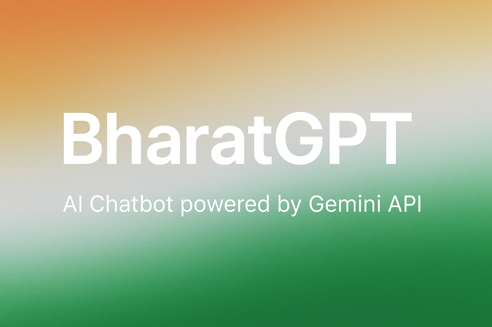

# BharatGPT

---

<div align="center">

  
*An AI chatbot designed for Indian languages and cultural contexts*

**An AI chatbot powered by the Gemini API, designed to deliver natural and contextual conversations with support for Indian languages and use cases.**

</div>

---

## 🚀 Features

- **Text Generation**: Powered by Google's Gemini API for high-quality responses
- **Context-Aware**: Maintains conversation context for natural interactions
- **Multi-Language Support**: Supports multiple Indian languages (Hindi, Tamil, Telugu, Bengali, and more)
- **Cultural Context**: Understands Indian cultural nuances and references
- **Easy Integration**: Simple backend API for frontend applications
- **Open Source**: Fully extensible and customizable

---

## 🛠 Tech Stack

- **Frontend**: React 18 + TypeScript
- **Build Tool**: Vite
- **Styling**: Tailwind CSS
- **AI Service**: Google Gemini API (@google/generative-ai)
- **Icons**: Lucide React
- **Deployment**: GitHub Pages
- **Linting**: ESLint

---

## 🏗 Architecture

```
┌─────────────────┐    ┌─────────────────┐    ┌─────────────────┐
│                 │    │                 │    │                 │
│   React App     │◄──►│   Gemini API    │◄──►│   Google AI     │
│   (Frontend)    │    │   Integration   │    │   Services      │
│                 │    │                 │    │                 │
└─────────────────┘    └─────────────────┘    └─────────────────┘
        │
        ▼
┌─────────────────┐
│                 │
│  GitHub Pages   │
│  (Deployment)   │
│                 │
└─────────────────┘
```

---

## 📋 Prerequisites

- Node.js 18+ and npm
- Google Gemini API Key ([Get it here](https://makersuite.google.com/app/apikey))
- Git

---

## ⚡ Installation & Setup

### 1. Clone the Repository
```bash
git clone https://github.com/rajvishwakarma1/BharatGPT.git
cd BharatGPT
```

### 2. Install Dependencies
```bash
npm install
```

### 3. Environment Configuration
Create a `.env` file in the project root and add your Gemini API key:

```env
VITE_GEMINI_API_KEY=your_gemini_api_key_here
```

### 4. Run the Development Server
```bash
npm run dev
```

The application will start at `http://localhost:5173`

### 5. Build for Production
```bash
npm run build
```

### 6. Deploy to GitHub Pages
```bash
npm run deploy
```

---

## 🎥 Demo Video

### Watch BharatGPT in Action

[](https://youtu.be/your-video-id)

*Click the image above to watch a full demonstration of BharatGPT's capabilities*

**🎬 What's covered in the demo:**
- Setting up BharatGPT locally
- Multi-language conversation examples
- API integration walkthrough
- Real-time chat demonstrations in Hindi, English, and other Indian languages
- Cultural context understanding showcase

**📺 Alternative Demo Links:**
- [YouTube Demo](https://youtu.be/your-video-id) - Full feature walkthrough
- [Loom Quick Demo](https://loom.com/your-demo-link) - 3-minute overview
- [Live Demo Site](https://rajvishwakarma1.github.io/BharatGPT) - Try it yourself!

---

## 🎯 Usage

### Live Demo
Try BharatGPT live at: [https://rajvishwakarma1.github.io/BharatGPT](https://rajvishwakarma1.github.io/BharatGPT)

### Local Development
1. Start the development server: `npm run dev`
2. Open your browser and navigate to `http://localhost:5173`
3. Enter your message in Hindi, English, or other supported Indian languages
4. Experience contextual AI responses tailored for Indian users

### Integration Example
```typescript
import { GoogleGenerativeAI } from '@google/generative-ai';

const genAI = new GoogleGenerativeAI(process.env.VITE_GEMINI_API_KEY!);

async function generateResponse(prompt: string) {
  const model = genAI.getGenerativeModel({ model: "gemini-pro" });
  const result = await model.generateContent(prompt);
  const response = await result.response;
  return response.text();
}

// Example usage
const response = await generateResponse("भारत की राजधानी क्या है?");
console.log(response);
```

---

## 🌐 Supported Languages

- **Hindi** (hi)
- **English** (en)
- **Tamil** (ta)
- **Telugu** (te)
- **Bengali** (bn)
- **Marathi** (mr)
- **Gujarati** (gu)
- **Kannada** (kn)
- **Malayalam** (ml)
- **Punjabi** (pa)

---

## 📁 Project Structure

```
BharatGPT/
├── public/              # Static assets
├── src/                 # Source code
│   ├── components/      # React components
│   ├── hooks/          # Custom React hooks
│   ├── utils/          # Utility functions
│   ├── types/          # TypeScript type definitions
│   ├── App.tsx         # Main App component
│   ├── main.tsx        # Application entry point
│   └── index.css       # Global styles
├── .env                # Environment variables
├── package.json        # Node.js dependencies
├── tsconfig.json       # TypeScript configuration
├── tailwind.config.js  # Tailwind CSS configuration
├── vite.config.ts      # Vite configuration
└── README.md           # Project documentation
```

---

## 🤝 Contributing

We welcome contributions! Here's how to get started:

1. **Fork the repository**
2. **Create a feature branch**
   ```bash
   git checkout -b feature/your-feature-name
   ```
3. **Make your changes**
4. **Test your changes**
   ```bash
   npm run dev
   npm run build
   ```
5. **Commit your changes**
   ```bash
   git commit -m "Add: your feature description"
   ```
5. **Push to your branch**
   ```bash
   git push origin feature/your-feature-name
   ```
6. **Open a Pull Request**

### Contribution Guidelines
- Follow React and TypeScript best practices
- Use Tailwind CSS for styling
- Add proper TypeScript types
- Test your changes locally before submitting
- Ensure all linting passes: `npm run lint`

---

## 📝 License

This project is licensed under the MIT License - see the [LICENSE](LICENSE) file for details.

---

## 🔗 Links

- **GitHub Repository**: [https://github.com/rajvishwakarma1/BharatGPT](https://github.com/rajvishwakarma1/BharatGPT)
- **Issues**: [Report a bug or request a feature](https://github.com/rajvishwakarma1/BharatGPT/issues)
- **Discussions**: [Join the community discussion](https://github.com/rajvishwakarma1/BharatGPT/discussions)

---

## 👨‍💻 Author

**Raj Vishwakarma**
- GitHub: [@rajvishwakarma1](https://github.com/rajvishwakarma1)
- LinkedIn: [Raj Vishwakarma](https://linkedin.com/in/rajvishwakarma1)
- Email: raj.vishwakarma@example.com

---

## 🙏 Acknowledgments

- Thanks to Google for providing the Gemini API
- Inspired by the need for AI that understands Indian cultural context
- Built with ❤️ for the Indian developer community

---

## 📊 Project Stats


---

**Powered by Google Gemini API and open-source contributions 🚀**